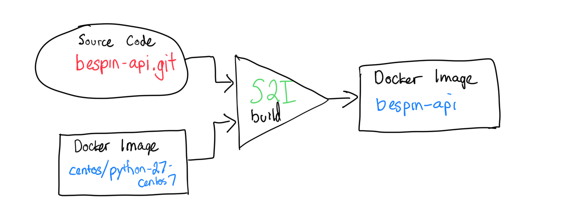

## You're not root here

### Adapting Dockerized applications for Openshift

Dan Leehr

Duke Openshift Users Group | September 26, 2018
---
## Why do I need to adapt?


- Docker image is the currency
- Build, ship, run
- Can't I just run existing docker images?

---
## Application: Bespin
Collection of services to run reproducible computational workflows on Openstack cloud.

[github.com/Duke-GCB/bespin](https://github.com/Duke-GCB/bespin)

</img>

---

## Step 1: Building (Dockerizing)

- 1 Service -> 1 Container
- Docker Hub: Official images or auto-build `Dockerfile`s
  - `postgres:9.5`, `dukegcb/bespin-api:1.2.2`
- Config and secrets to `ENV` vars
- Docker images = 💰

---
## Step 2: Deployment

Ansible playbooks: [Duke-GCB/gcb-ansible-roles](https://github.com/Duke-GCB/gcb-ansible-roles)

_Application architecture as code_
```
- name: Create app container
  docker_container:
    image: "dukegcb/bespin-api:{{ bespin_settings.web.version }}-apache"
    name: bespin-web
    env: "{{ web_environment }}"
    volumes:
      - /etc/external/:/etc/external/
      - "{{ bespin_settings.ui.srv_dir }}:/srv/ui/"
    ports:
      - "80:80"
      - "443:443"
    pull: true
    etc_hosts: "{{ bespin_hosts_list }}"
    state: started
    restart_policy: always
```

---

## Step 3: Automation ¯\\_(ツ)_/¯

Not really automated.

1. Release code (`git tag`)
2. Wait for Docker Hub to build tagged image
3. Edit, commit, push ansible changes
4. Run `ansible-playbook`

---


Kubernetes runs Docker images, let's dig in with a ...
---
# Hackday


Kubernetes Hackday!
---

## Openshift:

- Is a distribution of **Kubernetes**
  - `kubectl` and YAML
- Adds Developer friendly features
  - Deploy from source code (PaaS)
- `oc` CLI and Web interface
  - Productive and Easy

---

## Creating Applications

`$ oc new-app ...`

or


---

## Protip: Work in YAML

_Via Darin London_

1. Generate YAML to deploy each Docker image using `oc new-app`
2. Version/edit that YAML locally
3. Deploy those applications using `oc create`

_Compared to writing longhand or k8s: 👍_

---

## Hackday goal: Bespin on Openshift

- Can I orchestrate Bespin on Openshift?
- How about just the API and database?
- **I've already got Docker images**
- This will be done in like 5 minutes, right?

```
# Generate DeploymentConfigs from docker images
oc new-app postgres:9.5 \
    --dry-run=true -o yaml > bespin-db.yml

oc new-app dukegcb/bespin-api:1.2.2-apache \
    --dry-run=true -o yaml > bespin-api.yaml
# Tweak YAML

oc create -f bespin-db.yml
oc create -f bespin-api.yml
```
<!-- .element: class="fragment" -->

---

## Nope

```
initdb: could not change permissions of directory "/var/lib/postgresql/data": Operation not permitted
fixing permissions on existing directory /var/lib/postgresql/data ...
```

```
(13)Permission denied: AH00023: Couldn't create the
  rewrite-map mutex (file /var/lock/apache2/rewrite-map.19)
AH00016: Configuration Failed
Action '-DFOREGROUND' failed.
```


---

## You're Not Root Here

> **By default, OKD runs containers using an arbitrarily assigned user ID.** This provides additional security against processes escaping the container due to a container engine vulnerability and thereby achieving escalated permissions on the host node.

[docs.okd.io/latest/creating_images/guidelines.html](https://docs.okd.io/latest/creating_images/guidelines.html)

---
## Ruh-Roh

- **postgres:9.5**
  - `useradd -r -g postgres --uid=999`
- **bespin-api:1.2.2-apache**
  - `PORT` 80/443, Apache with mod_wsgi
  - Permissions in `/var/lock/apache2/`

_Why can't I just run **my docker images**, isn't that the whole point?_

---
## No

_Why can't I just run **my docker images**, isn't that the whole point?_

1. **Security**. Principle of least privilege should still apply, even inside containers. See [Chris Collins - Musings on Cluster Security](https://docs.google.com/presentation/d/1LiF5PAwE_HpQXxAhNNr3mICFofUeVLvQ-JiHZOWv6Xg/edit?usp=sharing)
2. Docker is an implementation detail.

_The point is to build, deploy, update, rollback, and scale applications easily._

---

## Starting over

Focus on three services, real-world use cases:

<table>
  <tr><th>Service</th><th>Purpose</th></tr>
  <tr><td>postgres</td><td>Relational Database</td></tr>
  <tr><td>bespin-api</td><td>REST API Server (Python)</td></tr>
  <tr><td>bespin-ui</td><td>Web UI (HTML/JS)</td></tr>
</table>

---

## Running Postgres

**Goal**: Run a Postgres 9.5 database

<div>
**Solution**: Use the Openshift-compatible **sclorg** image:
</div><!-- .element: class="fragment" -->


<div>
```
oc new-app centos/postgresql-95-centos7 \
  --dry-run=true -o yaml > bespin-db.yml
```
_Also what you get by choosing Postgres in the catalog_
</div><!-- .element: class="fragment" -->

<!-- .element: class="fragment" -->

---

## Running Bespin-API

**Goal**: Run my Python+Apache+JavaScript image with public https on port 443, connect it to Postgres.

**Solution**:

<div>
1. Don't do that.
2. Split up all those concerns.
</div><!-- .element: class="fragment" -->

---
## Protip: Use S2I

**Goal**: Run my Python application, connect it to Postgres.

- Openshift is PaaS, give it source code!
- **S2I** (Source-To-Image) builds Docker images
- **S2I** can be installed locally for development.

<div>
```
$ s2i build \
  https://github.com/Duke-GCB/bespin-api \
  centos/python-27-centos7 \
  bespin-api
$ docker run bespin-api whoami
default
```
_Look Ma, no Dockerfile and no root_
</div>
<!-- .element: class="fragment" -->

---
## S2I Required changes

- Delete the `Dockerfile`
- Use gunicorn instead of Apache/mod_wsgi
- Set build-time ENV vars in `.s2i/environment`

_Docker is just an implementation detail_

---
## Creating Openshift Build

```
oc new-app \
  python:2.7~https://github.com/Duke-GCB/bespin-api \
  --dry-run=true -o yaml > bespin-api.yml
```

<div>

</div><!-- .element: class="fragment" -->

---
## Triggering Builds

Builds can be started from CLI:

    oc start-build bespin-api

_...or via webhook, when the base image updates, or when you click **build**_

</img>

---

## Running Bespin-UI

**Goal**: Serve Ember JS application

**Considerations**:

- Ember JS app requires Node.js to **build**
- Output is static HTML/JS, does not require Node.js


---
<style>
.container{
    display: flex;
}
.col{
    flex: 1;
}
</style>

## Building Bespin-UI

[Advanced Build Operations: Chaining Builds](https://docs.openshift.com/container-platform/3.10/dev_guide/builds/advanced_build_operations.html#dev-guide-chaining-builds)
<div class="container">
  <div class="col">
    <ul>
      <li>Build dependencies might increase size or introduce vulnerabilities</li>
      <li>Chain 2 builds: 1 produces the artifact, 2 places artifact in image that runs it</li>
    </ul>
  </div>
  <div class="col">

  </div>
</div>

---
## Multi-stage builds

1. Build with `centos/nodejs-8-centos7`
2. Copy output to `centos/httpd-24-centos7`

---
## Bespin-UI Stage 1

From the CLI, generate the nodejs build:

```
oc new-app \
  centos/nodejs-8-centos7~https://github.com/dleehr/bespin-ui \
  --name bespin-ui \
  --dry-run=True -o yaml > bespin-ui.yml
```

```
- apiVersion: v1
  kind: BuildConfig
  spec:
    output:
      to:
        kind: ImageStreamTag
        name: bespin-ui-ember-build:latest
    source:
      git:
        uri: https://github.com/dleehr/bespin-ui
      type: Git
    strategy:
      sourceStrategy:
        from:
          kind: ImageStreamTag
          name: nodejs-8-centos7:latest
      type: Source
```

---
## Bespin-UI Stage 2

Add a second `BuildConfig` to copy artifacts in `httpd` container build

```
- apiVersion: v1
  kind: BuildConfig
  spec:
    source:
      type: Dockerfile
      dockerfile: |-
        FROM centos/httpd-24-centos7:latest
        COPY dist/* /var/www/html/
      images:
      - from:
          kind: ImageStreamTag
          name: bespin-ui-ember-build:latest
        paths:
        - sourcePath: /opt/app-root/src/dist
          destinationDir: "dist"
```
---
## Building Bespin-UI

Final bespin-ui image is just `httpd` with HTML+JS

<div>

</div><!-- .element: class="fragment" -->

---
## Routing and TLS

**Goal**: Unify `http://bespin-ui:8080` and `http://bespin-api:8080` behind a single **https** route

<div>
**Solution**: Create a reverse proxy (httpd or nginx)

*Start with a source build*
```
oc new-app \
  centos/httpd-24-centos7~https://github.com/openshift/httpd-ex \
  --name bespin-revproxy \
  --dry-run=True -o yaml > bespin-revproxy.yml
```
</div><!-- .element: class="fragment" -->

---
1. Write a Proxy config:
```
ProxyPass "/api/" "http://bespin-api:8080/api/"
ProxyPassReverse "/api/" "http://bespin-api:8080/api/"
ProxyPass "/" "http://bespin-ui:8080/"
ProxyPassReverse "/" "http://bespin-ui:8080/"
```
2. Import into a `ConfigMap`:
```
oc create configmap bespin-revproxy-config \
  --from-file=bespin-revproxy.conf \
  --dry-run=True -o yaml > bespin-revproxy-config.yml
```
3. Mount it as a volume:
```
spec:
  containers:
    volumeMounts:
    - name: bespin-revproxy-config-volume
      mountPath: /opt/app-root/etc/httpd.d
      readOnly: true
  volumes:
    - name: bespin-revproxy-config-volume
      configMap:
        name: bespin-revproxy-config
```

---
## Network Diagram


---
## Incoming traffic - https

To allow incoming traffic, we must **expose** the service with a route.

```
oc expose service bespin-revproxy \
  --dry-run=True -o yaml > bespin-revproxy-route.yml
```

Add the following to enable `https`:

```
spec:
  tls:
    termination: edge
```

_This will host from a subdomain, good for development_

---
## Putting it all together

```
# Make sure we're using the right project
oc project gcb-bespin

# Create configs
oc create -f bespin-db-config.yml
oc create -f bespin-api-config.yml
oc create -f bespin-revproxy-config.yml

# Now create the services
oc create -f bespin-db.yml
oc create -f bespin-api.yml
oc create -f bespin-ui.yml
oc create -f bespin-revproxy.yml

# Finally, create the one route into the proxy
oc create -f bespin-revproxy-route.yml
```
[github.com/dleehr/hackday-bespin-api-devcloud](https://github.com/dleehr/hackday-bespin-api-devcloud)

---
## Bonus round

`oc` Troubleshooting and Debugging Commands:
```
logs            Print the logs for a resource
rsh             Start a shell session in a pod
rsync           Copy files between local filesystem and a pod
port-forward    Forward one or more local ports to a pod
debug           Launch a new instance of a pod for debugging
exec            Execute a command in a container
proxy           Run a proxy to the Kubernetes API server
attach          Attach to a running container
run             Run a particular image on the cluster
cp              Copy files and directories to and from containers.
```

---
## Summary

Openshift makes it easier to do things right

- Minimized privileges (not root)
- Separation of concerns
- Build from source
- Versioned deployment configs

---
## Thank you

- Email: dan.leehr@duke.edu
- Slides: [github.com/dleehr/2018-09-26-DOUG](https://github.com/dleehr/2018-09-26-DOUG)
- Examples: [github.com/dleehr/hackday-bespin-api-devcloud](https://github.com/dleehr/hackday-bespin-api-devcloud)
